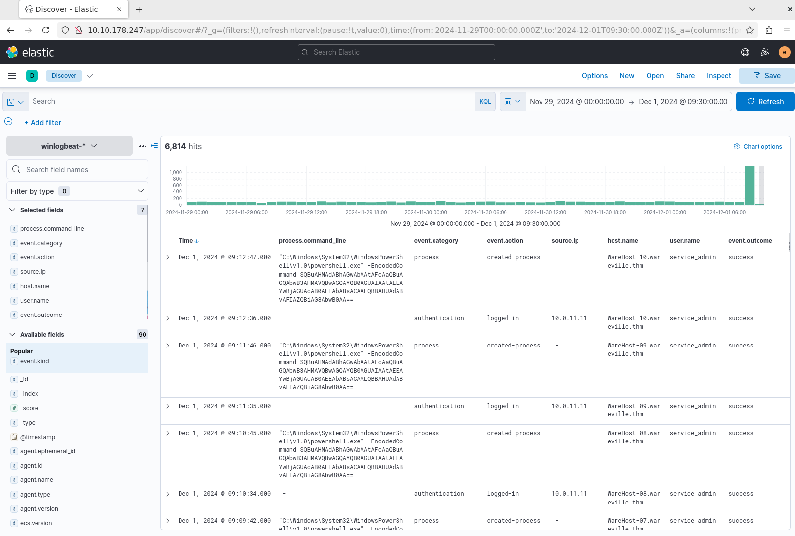
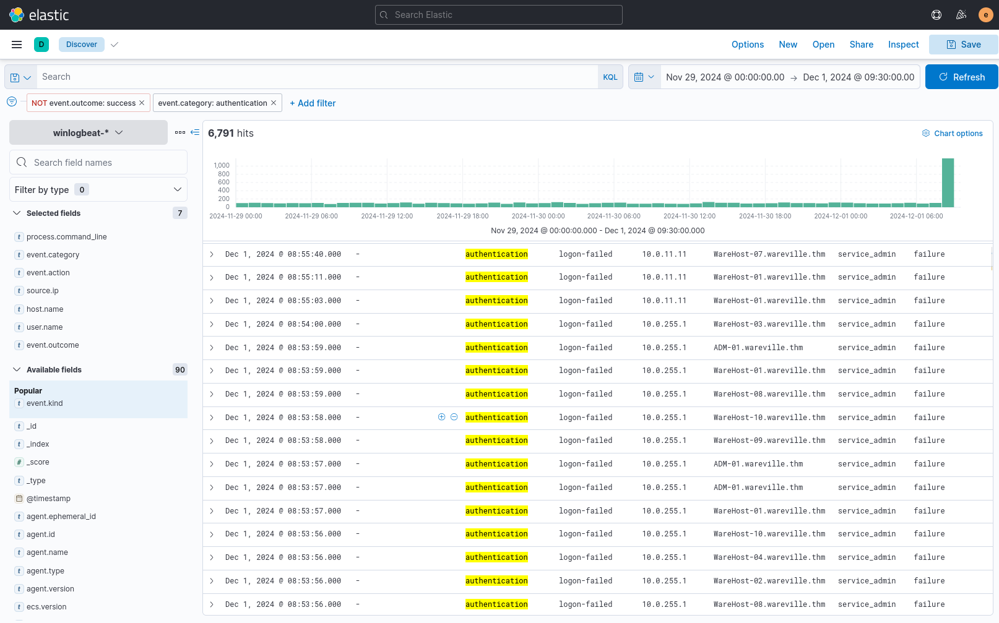
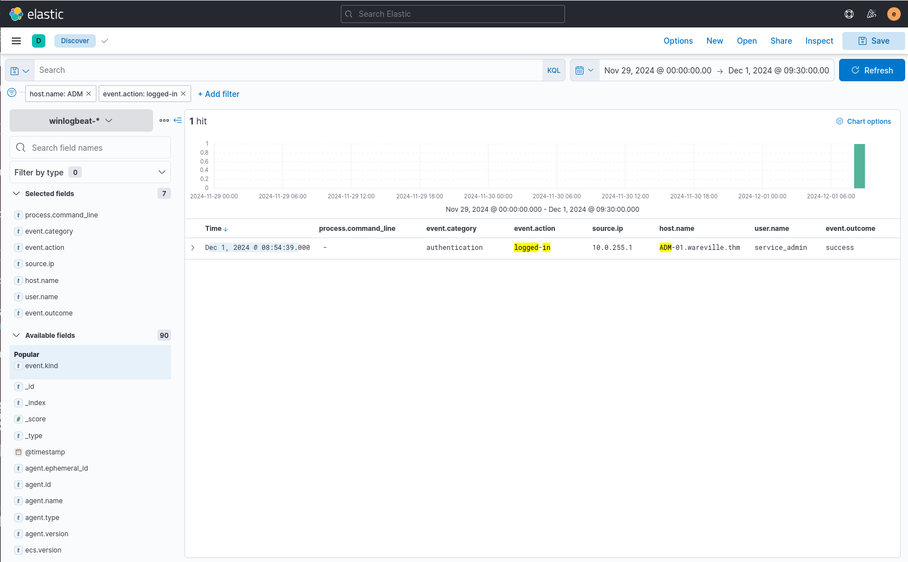

# Day 2: One man's false positive is another man's potpourri.

After going to `10.10.178.247` and logging in to elasticsearch, I headed to the analytics section and chose a wide time period of Nov 1, 00:00:00 - Dec 1, 09:30:00

I filter by `process.command_line`, `event.category`, `event.action`, `source.ip`, `host.name`, `user.name` and `event.outcome`.

which showed me 6814 hits.

I filter the database by `event.category:authentication` and `event.outcome:failure` to search for the account causing all the failed login events and I see an account with the `host.name` as `service_admin` with a total of 6791 hits

After looking at the `source.ip` section I only saw two IPs `10.0.255.1` and `10.0.11.11`.

As per the questions, we had to find when did Glitch successfully log on to `ADM-01`, I filter by `host.name:ADM` and `event.action:logged-in` to see a single hit on `Dec 1, 2024 @ 08:54:39`

which also confirmed Glitch's IP address as `10.0.255.1`, as I looked at the `source.ip`.

Then I filtered again by `process.command_line:exists` to see 12 hits and all of them except 2 were encoded commands.

I decode the command and it was: `Install-WindowsUpdate -AcceptAll -AutoReboot`.
