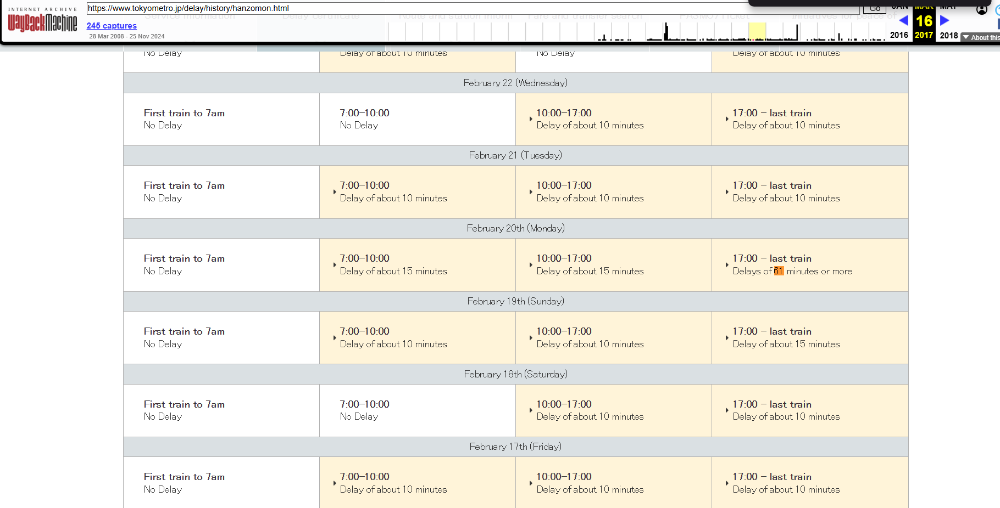

# Backtrack

Was a fun and simple OSINT challenge.

I directly googled "train 61 minutes late in Japan" and google directed me to Tokyo Metro's website which had Delay certificates on it, I googled and saw that the line connecting Omotesando and Suitengumae stations was the Hanzomon line.

I didn't see data older than a few months on the `https://www.tokyometro.jp/delay/history/hanzomon.html` website so I used the Wayback Machine.

I went to the first snapshot on March 16, 2017 and searched for 61 minutes and found it.

flag: `nite{17:00_20February}`
