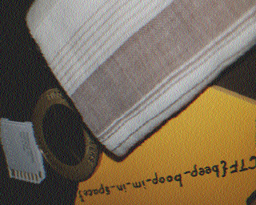
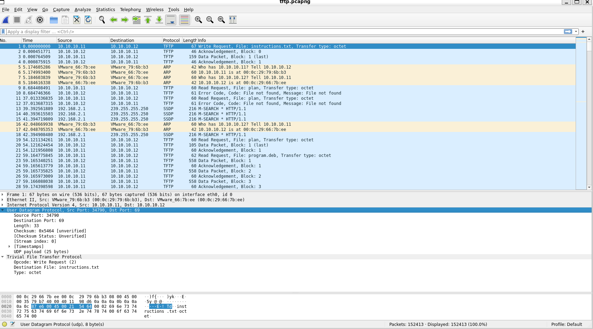

# picoCTF: Forensics

_for picoCTF Forensics challenges_

## m00nwalk

On checking both the hints and searching for a connection between "Scottie" and "Radio Signals", I found out about the SSTV encoding. The given audio file was just a encoded audio signal in Scottie 1 mode.

I tried searching for SSTV decoding software online and came across this project on github to decode SSTV signals: `https://github.com/colaclanth/sstv`

After setting up the tool, I decoded the `message.wav` file by:-

```
sstv -d message.wav -o result.png
```

which gave me `result.png` and the flag which was an image.

flag: 


### incorrect tangents

Not quite incorrect but I did try to analyse the file using Audacity, on checking the spectrograph I just noticed again that it's a pulsating signal but the approach was a dead-end.

On learning that the signal is SSTV encoded, I installed `qsstv` software however I couldn't decode the file using it since it's probably not made for decoding.

### learnings from m00nwalk

1. got to know about SSTV
2. learned how to decode SSTV audio files to get images

## Trivial Flag Transfer Protocol

The challenge gives us a `.pcapng` file to analyse which contains captured network packets and records. I open the file using Wireshark and look at the details of each packet transfer.



on researching about the different protocols mentioned, TFTP is the one which is used for actual data transfer and I can extract data from this file by exporting `objects > TFTP`

After exporting objects I got 3 `.bmp` pictures, `instructions.txt` (encrypted), `plan.txt` (encrypted) and one `program.deb` file, `program.deb` is a debian executable file which I find by running `$ file program.deb` and it can be extracted using `dpkg-deb -x program.deb extracted-folder/`

On going through `extracted-folder` I find a binary of `steghide` tool and files related to it which must mean this tool will be used in the challenge.

I shift my focus towards the `instructions.txt` file and `plan` file which are encrypted, I identify the encryption process (turned out to be ROT13) by using this tool: `https://www.cachesleuth.com/multidecoder/`

now on decrypting `instructions.txt` file and `plan` file respectively I get:-

```
TFTPDOESNTENCRYPTOURTRAFFICSOWEMUSTDISGUISEOURFLAGTRANSFER.FIGUREOUTAWAYTOHIDETHEFLAGANDIWILLCHECKBACKFORTHEPLAN

IUSEDTHEPROGRAMANDHIDITWITH-DUEDILIGENCE.CHECKOUTTHEPHOTOS
```

Seems the flag is hidden in the photos and `DUEDILIGENCE` is the password to recover the flag.

On using `steghide` to recover the flag, I use it on every photo with the obtained password, `picture3.bmp` yields the flag on:-


```
$ steghide extract -sf picture3.bmp
Enter passphrase:
wrote extracted data to "flag.txt".
```

On reading `flag.txt` we get:-

flag: `picoCTF{h1dd3n_1n_pLa1n_51GHT_18375919}`

### incorrect tangents

Instead of trying to decode the two `.txt` files using a multi-decoder tool, I wasted time searching for clues in the `extracted-folder`

### learnings from TFTP

1. learned how to look at .pcapng files using Wireshark and extract files
2. learned how to use steghide to extract flag from an image
3. learned how to extract a .deb file

## tunn3l v1s10n

After fixing the header referring `https://en.wikipedia.org/wiki/BMP_file_format` (particularly fixing the bits at offsets 0A and 0E respectively which denoted starting address of the pixel array (offset by 54 bytes) and size of the header respectively (40 as per the page referred)) I opened the image but it showed `notaflag{sorry}`

I spent quite some time here at this point, I thought that image the is too short so to test this I ran exiftool on the image and saw it was of 1134x818 dimensions, I went to the exact bytes representing the image height and width (at offsets 12 and 16 in hex respectively) and saw that the height of the image looked off as `ghex` only showed 00000032 (converted from little endian) I repaired the height to 00000332 (818 in hex) and after this repair I used `feh` to show me the image and there was the flag!

flag: `picoCTF{qu1t3_a_v13w_2020}`

### incorrect tangents

TOO MANY INCORRECT TANGENTS, took me forever to understand the offsets in the header and what values to manipulate and which ones not to, only by reading the page again and again I pieced it together.

### learnings from tunn3l v1s10n

1. how to look up and read information about headers
2. how writing in little endian looks
3. understanding about offsets 
4. how to fix files with corrupt headers


