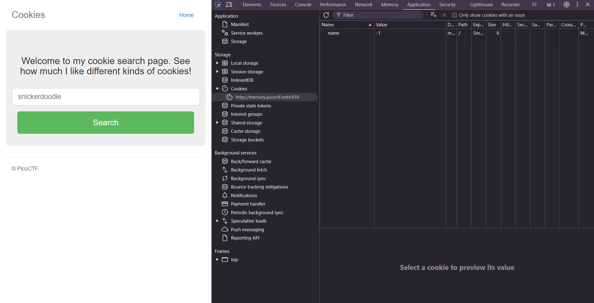
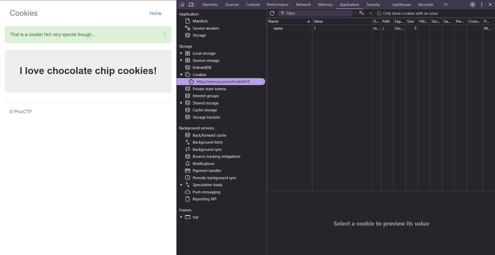
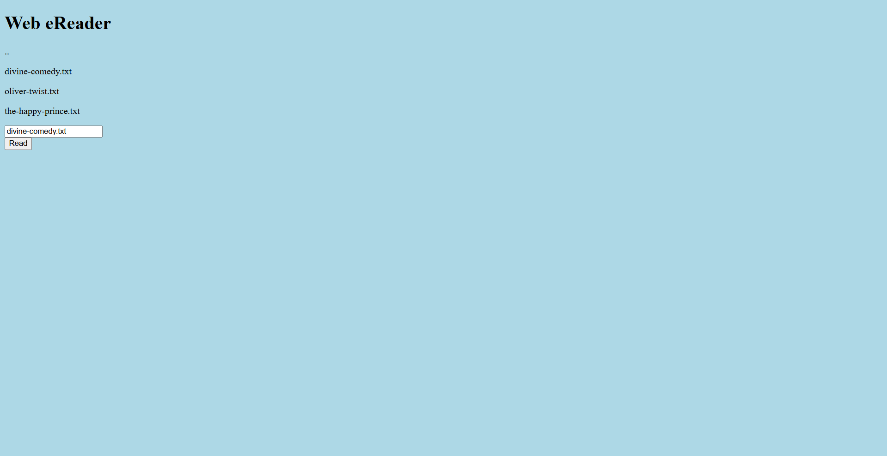
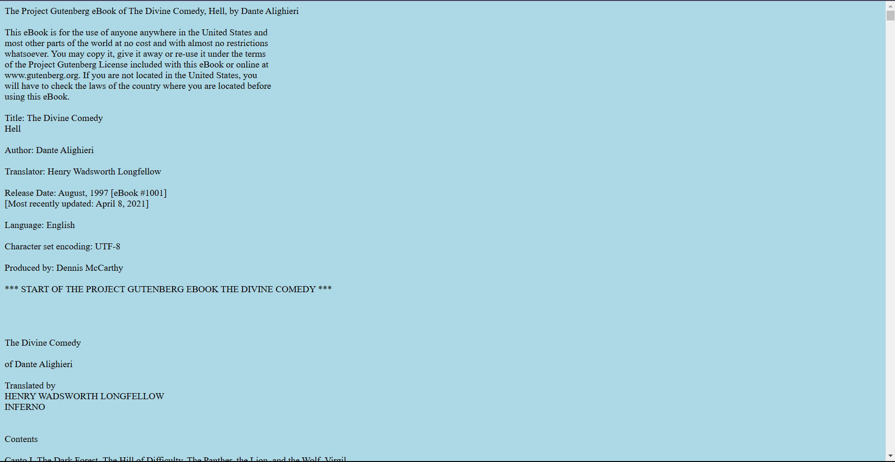
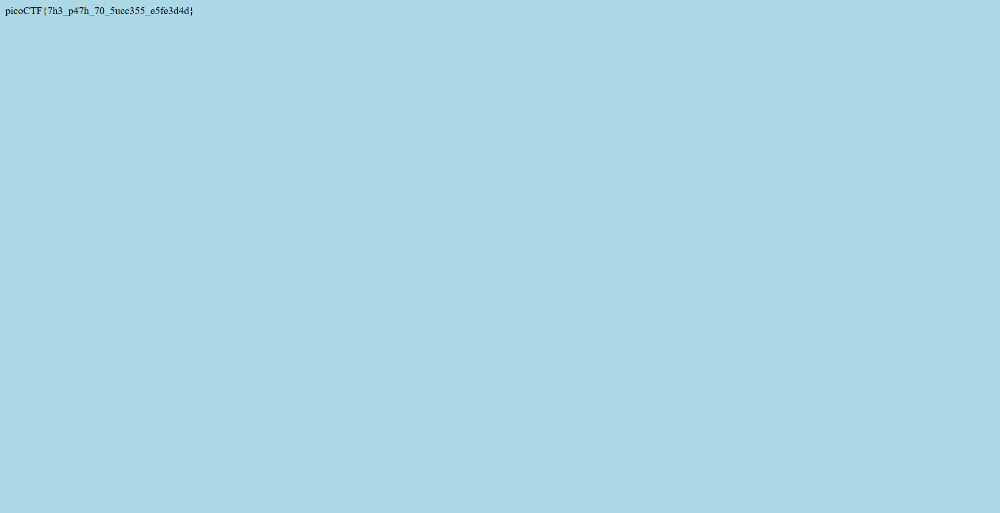

# picoCTF: Web Exploitations

_for picoCTF Web Exploitation challenges_

## Cookies

challenge involved the website `http://mercury.picoctf.net:6418/`

On inspecting the website, a prompt was visible which accepted only valid cookie names, I headed to the Applications Tab inside the developers tools and went to the cookies section under Storage. Only one cookie with `Name = 'name'` and `Value =  -1` was visible.



The site checks the prompt at `http://mercury.picoctf.net:6418/check` when it's entered and on entering the default prompt `snickerdoodle`, I noticed the value change to `0`. After editing the value to `1` I saw the name of the cookie on the site changed.



I kept incrementing the cookie value until `Value = 18` which showed me the flag:-

flag: `picoCTF{3v3ry1_l0v3s_c00k135_88acab36}`


### incorrect tangents

None

### learnings from cookies

learned editing cookie values can change the website
 

# Forbidden Paths

challenge involved the website: `http://saturn.picoctf.net:62199/`

on looking at the website there was a prompt which took in filenames it had access to and names of files. I could enter `divine-comedy.txt` and the website would start reading it. 






So basically the website reads any file you give to it. The challenge description told us that the flag would be stored at `/flag.txt` but the website lives in `/usr/share/nginx/html`

The challenge statement also tells us that absolute paths are filtered by the website, however we can still give it the path to `/flag.txt` using our knowledge about relative paths from Linux Luminarium.

relative path to `/flag.txt` from `/usr/share/nginx/html`: `../../../flag.txt`

Putting `../../../flag.txt` into the prompt and we get the flag.



flag: `picoCTF{7h3_p47h_70_5ucc355_e5fe3d4d}`

### incorrect tangents

wasted some time looking around using developer tools.

### learnings from forbidden paths

1. learned how to traverse through files on a web server
2. recalled relative paths from Linux Luminarium


## SOAP

I checked the hint and this involved a XXE injection, I just went over to Advent of Cyber Day 5 which covered the same topic and after learning from there I did the exact same thing here!

I launched BurpSuite and turned on Intercept Mode, when I clicked on detail and inspected the intercepted request I could see XML code written, I injected this:-

```
<?xml version="1.0" encoding="UTF-8"?>
<!DOCTYPE foo [<!ENTITY payload SYSTEM "file://etc/passwd"> ]>
<data>
  <ID>
      &payload;
  </ID>
</data>
```

and got the output which contained the flag


flag: `picoCTF{XML_3xtern@l_3nt1t1ty_0dcf926e}`


### incorrect tangents

None, just went over to Advent of Cyber and learned it.

### learnings

1. How to intercept requests using Burpsuite
2. how to perfom an XXE Injection Attack

